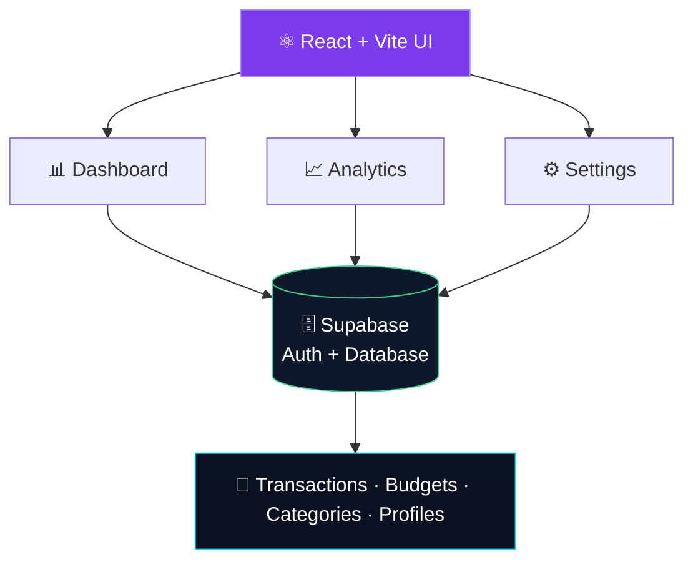

<div align="center">


<a href="https://github.com/mohitjoshi-dev/TrackDoor">
  
</a>

<br/>

**A modern full-stack personal finance dashboard.**
Clear. Visual. Intelligent.

<br/>

<a href="https://visionary-queijadas-526f9b.netlify.app/"></a>
<a href="https://github.com/mohitjoshi-dev/TrackDoor"></a>
<a href="./LICENSE"></a>

<br/><br/>


</div>

<br/>

---

## ⚡ See it in action

<div align="center">

<a href="https://visionary-queijadas-526f9b.netlify.app/">
  
</a>

<sub>🎥 A quick walkthrough: dashboard → transactions → budgets → analytics.<br/>Click the demo to open the live app.</sub>

</div>

---

## ✦ The idea

> **Your financial data should tell a story, not just show numbers.**

Scattered notes, messy spreadsheets and plain expense lists don't cut it. TrackDoor brings your **transactions, budgets, analytics, preferences and insights** into one focused dashboard, so you always know where you stand.

<div align="center">

| 💳 **TRACK** | 📊 **ANALYZE** | 🎯 **CONTROL** |
|:---:|:---:|:---:|
| Log income & expenses | Visualize spending patterns | Set & monitor budgets |
| Organize by category | Interactive charts | Stay within your limits |
| Full transaction history | Category breakdowns | Make informed decisions |

</div>

---

## ✨ What makes it different

<table>
<tr>
<td width="50%" valign="top">

### 💸 Expense Intelligence
Structured categories, dates, notes and full history for every transaction.
**→ Know where your money actually goes.**

</td>
<td width="50%" valign="top">

### 📈 Visual Analytics
Raw transactions turned into readable charts and spending patterns.
**→ Numbers become understandable.**

</td>
</tr>
<tr>
<td width="50%" valign="top">

### 🎯 Budget Management
Create budgets and watch spending against your limits.
**→ Plan before you overspend.**

</td>
<td width="50%" valign="top">

### 🤖 Intelligent Insights
Surface useful patterns from your own financial data.
**→ Let your data explain itself.**

</td>
</tr>
<tr>
<td width="50%" valign="top">

### 🔐 Secure Auth
Supabase-powered authentication keeps every user's data separate.
**→ Your dashboard, your data.**

</td>
<td width="50%" valign="top">

### 🎨 Made yours
Light, Midnight and AMOLED themes, plus currency, language and timezone preferences.
**→ It adapts to you.**

</td>
</tr>
</table>

---

## 🧩 Core features

<details open>
<summary><b>💰 Transactions</b></summary>

<br/>

- Add, edit, delete and organize income & expenses
- Category-based organization
- Transaction history and summaries

</details>

<details open>
<summary><b>📊 Dashboard & Analytics</b></summary>

<br/>

- Financial overview at a glance
- Income vs. expense breakdown
- Pie charts, bar charts and category analysis
- Spending trends and patterns

</details>

<details open>
<summary><b>🎯 Budgets</b></summary>

<br/>

- Create and manage budgets
- Track spending against planned limits
- Category-level performance monitoring

</details>

<details>
<summary><b>🔐 Authentication</b></summary>

<br/>

- Sign up / sign in
- Email verification
- Powered by Supabase Auth

</details>

<details>
<summary><b>🎨 Personalization</b></summary>

<br/>

- Light, Midnight and AMOLED themes
- Currency, language and timezone preferences

</details>

<details>
<summary><b>📦 Data portability</b></summary>

<br/>

- Export your financial data
- Import previously exported data

</details>

---

## 🖥️ Inside the app

| Module | What it does |
|:--|:--|
| **Dashboard** | High-level financial overview |
| **Transactions** | Manage income and expenses |
| **Budgets** | Plan and monitor spending |
| **Analytics** | Understand your financial patterns |
| **Categories** | Organize your transactions |
| **AI Insights** | Surface useful financial patterns |
| **Settings** | Themes, currency, language, timezone |
| **Profile** | Manage your account |

---

## 🏗️ Architecture



---

## 🚀 Run it locally

**1. Clone the repo**

```bash
git clone https://github.com/mohitjoshi-dev/TrackDoor.git
cd TrackDoor
```

**2. Install dependencies**

```bash
npm install
```

**3. Add your environment variables**

Create a `.env` file in the project root:

```env
VITE_SUPABASE_URL=your_supabase_project_url
VITE_SUPABASE_ANON_KEY=your_supabase_anon_key
```

> If your AI insights setup needs an extra key, add it here too.

**4. Start the dev server**

```bash
npm run dev
```

Open the local URL that Vite prints, and you're in. 🎉

---

## 📁 Project structure

```
TrackDoor/
│
├── public/
│
├── src/
│   ├── assets/
│   │   ├── scenes/
│   │   ├── hero.png
│   │   └── TrackDoor-Demo.gif
│   │
│   ├── components/
│   ├── pages/
│   └── main.jsx
│
├── supabase/
│
├── .gitignore
├── components.json
├── eslint.config.js
├── index.html
├── package.json
├── package-lock.json
├── vite.config.js
└── README.md
```

> 🔒 `.env` is intentionally excluded from the public repository.

---

## 🔐 Security

- Secrets live in environment variables, never in source code
- `.env` is git-ignored
- Supabase handles authentication
- Protect your tables with Supabase **Row Level Security** policies
- Never expose service-role keys in frontend code

---

## 🎨 Design direction

<div align="center">

`DARK-FIRST` · `GLASS SURFACES` · `SOFT GLOW` · `CLEAN TYPE` · `DATA OVER DECORATION` · `MICRO-INTERACTIONS`

</div>

Minimal noise, strong hierarchy, responsive layouts, and fast interactions over unnecessary animation.

---

## 🛣️ Roadmap

- ✅ Authentication
- ✅ Transactions & categories
- ✅ Budget management
- ✅ Analytics dashboard
- ✅ Theme system (Light / Midnight / AMOLED)
- ✅ Currency, language & timezone preferences
- ✅ Import / export
- ✅ Supabase integration
- ✅ Production deployment
- ⬜ More advanced financial insights
- ⬜ Better currency conversion across the app
- ⬜ Spending predictions
- ⬜ Recurring transactions
- ⬜ More analytics views
- ⬜ Enhanced mobile experience

---

## 🧪 What I learned building this

React architecture · reusable components · Tailwind & shadcn/ui · state and data management · auth flows · Supabase integration · env management · import/export · chart-based analytics · responsive dashboards · deployment · Git & GitHub workflows.

The goal: build something that feels like a **real product**, not just a college project.

---

<div align="center">

## 👨‍💻 Built by

**Mohit Joshi**
B.Tech Information Technology · Frontend / Full-Stack Developer

<a href="https://github.com/mohitjoshi-dev"></a>

<br/>

### If TrackDoor inspired you

⭐ **Star** the repo · 🍴 **Fork** it · 💬 **Share feedback**

<br/>

<a href="https://visionary-queijadas-526f9b.netlify.app/"></a>


</div>